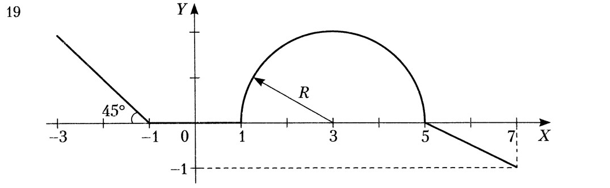

# lab1
## Лабораторная работа №1
### Задание: Вычисление значение функции
Поставлена задача, написать программу, которая по введённому значению аргумента вычисляет значение функции, заданной в виде графика. Парамметр R вводится с клавиатуры.

